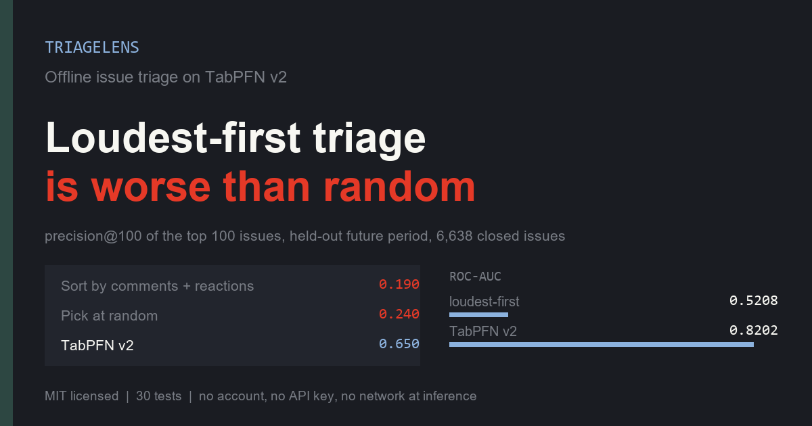
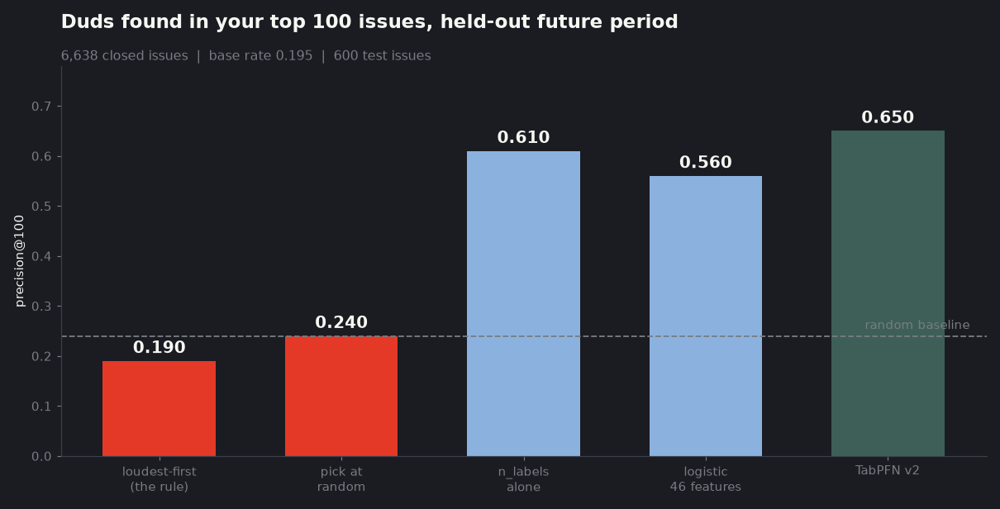
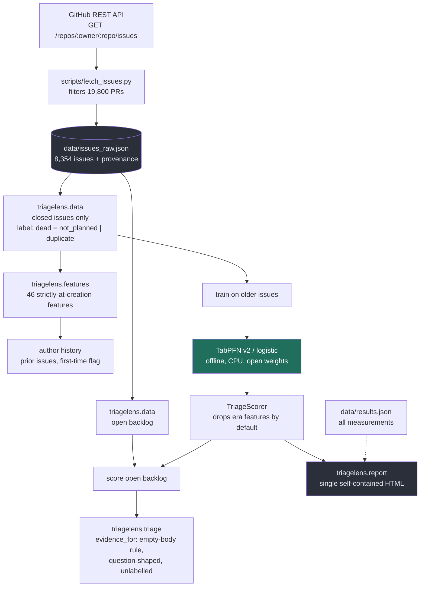

# TriageLens

**Which issues in your backlog will never get fixed?**



- **Write-up and full results:** [Everyone says triage the loudest issues first. I tested it on 6,638 real issues. It's worse than random.](https://dev.to/aniruddhaadak/everyone-says-triage-the-loudest-issues-first-i-checked-6638-real-ones-with-tabpfn-its-worse-3f6o) — my submission for the [Hacktoberfest Weekend Challenge](https://dev.to/challenges/hacktoberfest-weekend-2026-10-01) (`#hf26challenge`)
- **Live demo:** [the generated report for all 1,716 open ruff issues](https://triagelens-report-astral-sh-ruff-real-generated-3ykaxpxpc6.openbot.site)
- **Entry for the Best Use of TabPFN prize category.** TabPFN v2 posts the best ROC-AUC (0.8202) and the best precision@100 (0.650) of every model tested.

A private, fully offline issue-triage instrument for a solo maintainer. It runs
[TabPFN v2](https://github.com/PriorLabs/tabpfn) — Prior Labs' open-weights
tabular foundation model — on your own issue history, on your own laptop, with no
account, no API key, and no inference-time network access.

It exists because I measured the thing everyone tells maintainers to do, and it
does not work.

> **Sorting your backlog by comments and reactions scores ROC-AUC 0.5208 against a
> held-out future period — a coin flip. Worse, at precision@100 it returns 0.190,
> below the 0.240 you get by picking at random. Median comments is 2 on issues
> that never shipped and 2 on issues that did.**

Full numbers, including three hypotheses of mine that turned out to be wrong, are
in [`FINDINGS.md`](FINDINGS.md). What I predicted before fitting anything is in
[`HYPOTHESIS.md`](HYPOTHESIS.md).

---

## What it does

```
python -m triagelens.cli fetch astral-sh/ruff     # pull the corpus
python -m triagelens.cli triage                   # rank the backlog, write report.html
```

`report.html` is a single self-contained file — no build step, no CDN, no
JavaScript framework. Open it from disk.

## Results

Held-out **future** period, 600 issues, base rate 0.195. Train 2022-08 → 2025-03,
test 2025-03 → 2026-10.

| model | AUC | P@100 | P@10% |
| --- | --- | --- | --- |
| Constant "everything is alive" | 0.5000 | 0.240 | 0.217 |
| Loudest-first (the folk belief, leaky features) | 0.5208 | 0.190 | 0.167 |
| Single feature: `n_labels` | 0.7398 | **0.610** | 0.667 |
| Logistic, 46 triage-time features | 0.7869 | 0.560 | 0.650 |
| **TabPFN v2, triage-time features only** | **0.8202** | **0.650** | **0.700** |
| TabPFN + resolution-time labels & comments *(leak)* | 0.8095 | 0.580 | 0.733 |



Read the middle of that table carefully, because it is the most useful thing here:
**at the precision a maintainer actually works at — a shortlist — the one-line
`n_labels` rule (0.610) beats the 46-feature logistic model (0.560)**, despite a
much worse overall AUC. TabPFN wins both, and it is the only row I would put in a
sprint plan.

TabPFN's own stability across rolling time folds was **0.695 / 0.869 / 0.779**.
Treat 0.8202 as *about 0.8*, not as a precise figure.

## Install

Python 3.11+. CPU only; no GPU required.

```bash
git clone <this repo> && cd triagelens
python -m venv .venv && . .venv/bin/activate      # Windows: .venv\Scripts\activate
pip install -e .
```

`pip install tabpfn` pulls Torch. On first use, TabPFN downloads its v2 checkpoint
(~100 MB) from a public mirror and caches it; after that it never touches the
network.

```bash
python scripts/fetch_issues.py astral-sh/ruff      # writes data/issues_raw.json
python -m triagelens.cli triage --top 40 --out report.html
pytest                                             # 30 tests
```

## Two backends, and why one is the default

| | logistic | tabpfn |
| --- | --- | --- |
| AUC | 0.7869 | 0.8202 |
| Fit time (3,000 rows) | ~40 s | ~35 s |
| **Score time** | **instant** | **~0.9 s per issue** |
| 1,700-issue backlog | < 1 s | ~25 min |

TabPFN's CPU inference is roughly linear in the number of issues scored, which is
the single most important practical fact about this project. It is an overnight
batch job, not an interactive tool, so **`logistic` is the default** and TabPFN is
opt-in.

```bash
python -m triagelens.cli triage --model tabpfn     # ~25 min for a full backlog
python -m triagelens.cli triage --limit 200         # score the 200 oldest
```

## Architecture



## The leakage rules this project holds itself to

The hard part of issue triage is not modelling. It is refusing to cheat. Four
rules, all enforced in code:

1. **Time splits, never random.** Train on older issues, score newer ones. A
   random split happens to be harmless *here* (inflation +0.00004) but it is the
   only split that matches deployment.
2. **Strictly-at-creation features only.** Comment counts and reaction totals are
   *consequences* of the outcome. They are quarantined in `features.LEAKY` and
   never enter the headline model.
3. **Resolution-time labels are quarantined.** `accepted`, `fixes`, `rule` and
   `preview` are applied by a maintainer *while closing*. Mixing them with
   triage-time labels is the easiest way to build a model that looks brilliant and
   is worthless.
4. **Era features are dropped at deployment, kept for analysis.**
   `issue_number` is the strongest single feature in-corpus (AUC 0.6305 over all
   6,638 issues). Hold the feature constant and change only the split — **0.6452
   on a random split, 0.5364 on a time split**. It is a calendar, not a signal.

## What the tool tells a maintainer

1. **Stop sorting by comments.** Never better than 0.55 AUC across four time
   windows, and worse than random in the top 100.
2. **Start with a one-line rule.** `n_labels` alone gets P@100 = 0.610.
3. **Use TabPFN only for shortlists.** ~0.9 s per issue on CPU.
4. **Empty-body issues first.** An empty body is 4.6x less likely to ever ship
   (3.2% vs 14.9%), and needs no model at all.
5. **Distrust scores on old issues.** The scorer warns what fraction of your
   backlog predates its training window — 31% on this one.

## Repo layout

```
triagelens/
  data.py          load corpus, derive labels, author history
  features.py      46 features; the triage-time / leaky boundary lives here
  experiments.py   every number in FINDINGS.md; checkpointed after each stage
  triage.py        TriageScorer, the empty-body rule, per-issue evidence
  report.py        self-contained HTML
  cli.py           fetch / triage / report
scripts/
  fetch_issues.py  corpus download with provenance
  validate_post.py field-limit guard for the DEV submission
  validate_pipeline.py, probe_tabpfn_access.py, smoke_tabpfn.py
                   access + pipeline checks
  bench_cpu_budget.py, price_tabpfn.py, compare_weighting.py, eda.py
                   the measurements behind FINDINGS.md
  show_results.py  pretty-print data/results.json
data/
  issues_raw.json  8,354 real issues (13 MB), body truncated to 4,000 chars
  results.json     every measurement
tests/             30 tests
HYPOTHESIS.md      pre-registered expectations, written before fitting
FINDINGS.md        what actually happened, including the wrong parts
POST_DRAFT.md      the DEV submission for the Hacktoberfest Weekend Challenge
```

## Known limitations

- **One repository.** `astral-sh/ruff` is well-maintained and heavily labelled. A
  repo with sparse labels would move every number.
- **`dead` is inferred from maintainer-assigned `state_reason`**, applied
  inconsistently by design across projects.
- **TabPFN v2, not 3.5** — 3.5 requires an interactive licence login, which makes
  unattended runs impossible. v2 has an ungated public mirror. v3.5 would likely
  score higher.
- **`dead` is not `bad`.** A question closed as a support answer is a good outcome.
  This finds issues that will not ship a *code change*, which is a different
  question from whether the maintainer handled them well.

## Licence

MIT. The bundled issue data belongs to its respective authors and is included for
reproducibility of the cited measurements; it is redistributed under the GitHub
Terms of Service.